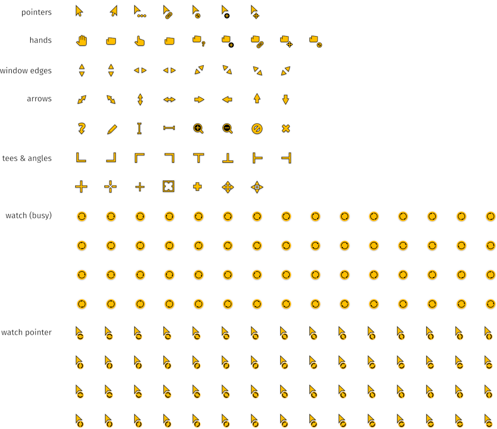

# Quintom Orange Cursor Theme

A simple and visible, yet elegant cursor theme, based on the original Quintom which in turn is based on DMZ.



### Build instructions

```
cd src/cursors
./render-cursors.py
./anicursorgen.py
./mklink.sh
```
This will build the Linux and Windows Cursor Set in the sizes: 24, 32, 48, 64 and 96 pixels.

